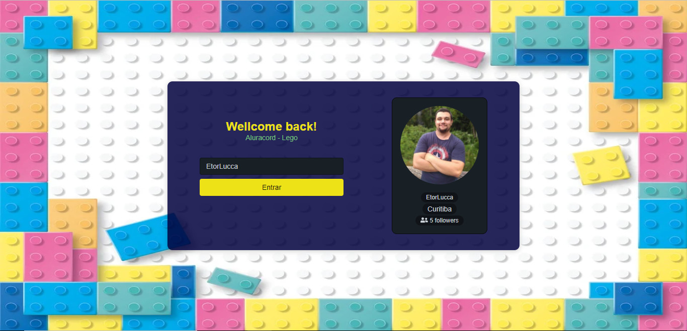

Projeto desenvolvido durante a Imersão React JS da Alura.

 
Linguagens/Libs/Frameworks utilizadas até o momento:

- HTML 
- CSS (styled componets) 
- React JS 
- Next JS 

 
Aprendizados durante a elaboração do projeto:

- Styled Components
- React/Next - Hooks, Components
- Github - interação com os dados públicos do Github

